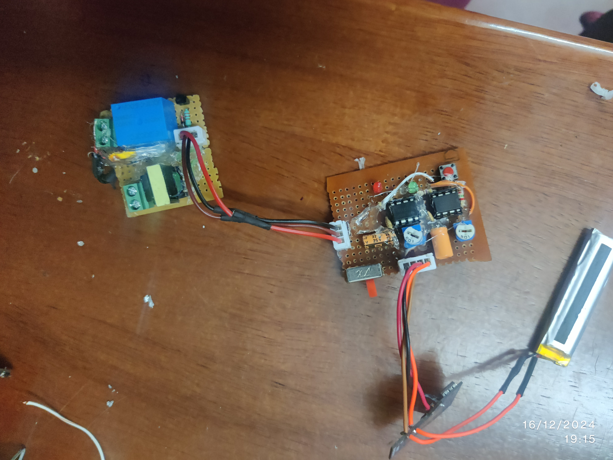

# TENS-Cramp-Relief-Device
TENS Cramp Relief Device using 555 timer and high freq transformer

The schemetics of the project is stored in [Here](./TENS-Cramp-Relief-Device-Schematics/) also the codes if there any will be stored [Here](./TENS-Cramp-Relief-Device-Code/)

## System Design

#### Work env

#### Version 0.0.1

#### Version 0.0.2

#### Final Version

